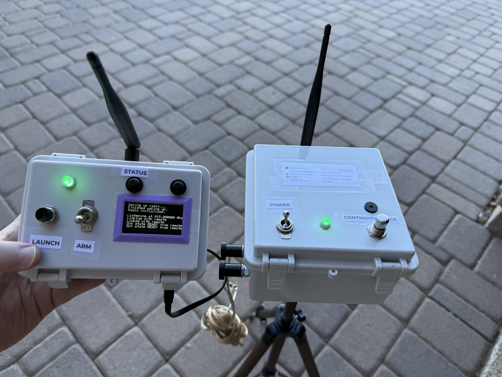

# LORA Launcher

An ESP32-based remote launch controller to support M, N, and O motor distances. Designed for the RF95 LoRa radio, this is solely for a pair (`CONTROLLER` and `REMOTE`).  Range up to 2km with line-of-sight, allowing for the 1,500' distance required for O motors.

